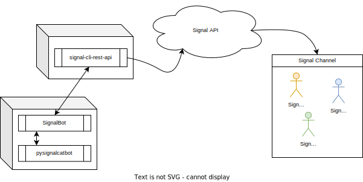

# Image publishing Signal Chatbot

This is a Signal Chatbot that can be used to publish images to a channel. Build with [SignalBot](https://github.com/filipre/signalbot), it utilizes the [signal-cli-rest-api](https://github.com/bbernhard/signal-cli-rest-api) to send messages to a Signal channel.

# Concept
